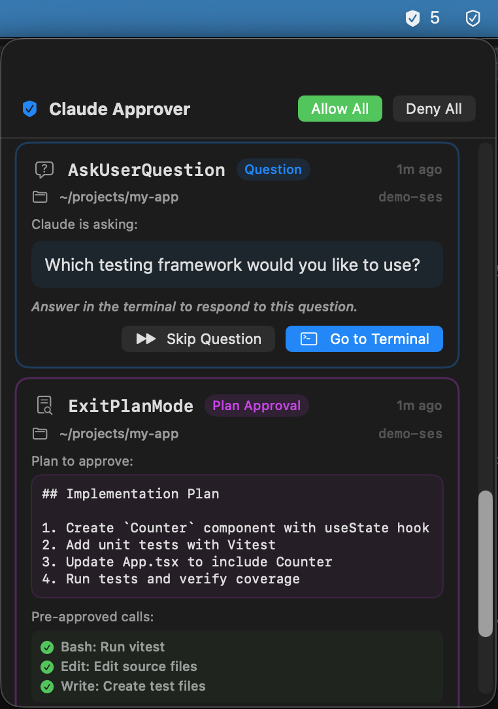

# ClaudeApprover

> **Disclaimer:** This is an unofficial, community-built tool. It is not affiliated with, endorsed by, or sponsored by Anthropic, PBC. "Claude" is a trademark of Anthropic, PBC.

A macOS menu bar app that replaces Claude Code's terminal permission dialogs with a native SwiftUI popover. Instead of switching to your terminal every time Claude Code needs approval, you get a clean GUI right from the menu bar.

<p align="center">
  
</p>

## How It Works

```
Claude Code  ──(hook)──>  Python script  ──(UDS)──>  Swift menu bar app
                                                          │
                                                     User decides
                                                     Allow / Deny
                                                          │
Claude Code  <──(hook)──  Python script  <──(UDS)──  DecisionResponse
```

1. Claude Code fires a `PermissionRequest` hook when it needs tool approval
2. A Python hook script reads the request from stdin and forwards it over a Unix Domain Socket
3. The SwiftUI menu bar app displays the request in a popover
4. You approve or deny; the response flows back through the same path

**Fail-open design** — if the app isn't running or anything goes wrong, the hook exits with code 1 and Claude Code falls back to its normal terminal dialog. You never get stuck.

## Features

- **Menu bar popover** — review permission requests without leaving your current window
- **Three request types** — tool permissions (Bash, MCP, etc.), questions (AskUserQuestion), and plan approvals (ExitPlanMode)
- **Risk indicators** — high/medium/low risk labels based on command heuristics
- **Always Allow** — grant persistent permissions using Claude Code's `updatedPermissions` API
- **Passthrough** — dismiss requests to let Claude Code handle them in terminal
- **macOS notifications** — get notified even when focused on other apps
- **Auto-open/close** — popover opens on new requests and closes when the queue is empty
- **Keyboard shortcuts** — approve, deny, and navigate without touching the mouse

## Keyboard Shortcuts

| Key | Action | Notes |
|-----|--------|-------|
| Enter / Return | Approve top request | Tool permission → Allow, Question → Go to Terminal, Plan → Approve |
| D | Deny top request | Ignored while typing in a text field |
| A | Allow all requests | Ignored while typing in a text field |
| X | Deny all requests | Ignored while typing in a text field |
| Escape | Close panel | |

## Requirements

- macOS 14.0+
- Swift 5.9+ (Xcode 15+ or standalone Swift toolchain)
- Python 3 (ships with macOS)
- [Claude Code](https://docs.anthropic.com/en/docs/claude-code) CLI

## Installation

```bash
# Clone into the Claude Code config directory
git clone https://github.com/daiki44/claude-approver.git ~/.claude/claude-approver
cd ~/.claude/claude-approver

# Build, bundle .app, register hook, and start via LaunchAgent
make install
```

This will:
1. Build the Swift package in release mode
2. Create a signed `.app` bundle
3. Register the `PermissionRequest` hook in `~/.claude/settings.json`
4. Install and start a LaunchAgent for auto-launch at login

**Restart Claude Code** for the hook to take effect.

## Makefile Targets

| Target | Description |
|--------|-------------|
| `make build` | Build the Swift package (release) |
| `make bundle` | Build + create signed `.app` bundle |
| `make install` | Bundle + register hook + install LaunchAgent |
| `make uninstall` | Remove hook registration + unload LaunchAgent |
| `make start` | Load the LaunchAgent |
| `make stop` | Unload the LaunchAgent |
| `make restart` | Stop + start |
| `make demo` | Build + launch with mock data for screenshots |
| `make clean` | Clean build artifacts + remove `.app` bundle |

## Project Structure

```
ClaudeApprover/
  Package.swift                    # SPM manifest (macOS 14+, Swift 5.9)
  Sources/
    ClaudeApproverApp.swift        # @main, menu bar only (no window)
    AppDelegate.swift              # NSPopover, status bar item, event monitors
    Models/
      PermissionRequest.swift      # Incoming request with risk assessment
      DecisionResponse.swift       # Allow/deny/passthrough response
      RequestType.swift            # toolPermission | question | planApproval
      RequestQueue.swift           # FIFO queue of pending requests
    ViewModels/
      ApproverViewModel.swift      # @Observable @MainActor, owns server + queue
    Views/
      PopoverRootView.swift        # Root view with header and content area
      RequestListView.swift        # Scrollable list of requests + completions
      RequestRowView.swift         # Delegates to type-specific row views
      ToolPermissionRowView.swift  # Bash/MCP/Write permission card
      QuestionRowView.swift        # AskUserQuestion with text input
      PlanApprovalRowView.swift    # Plan review with approval modes
      SharedHeaderView.swift       # Reusable row header component
      EmptyStateView.swift         # Shown when queue is empty
    Services/
      SocketServer.swift           # actor, Unix Domain Socket server
      NotificationService.swift    # macOS user notifications

hook/
  permission_request.py            # PermissionRequest hook (stdin → UDS → stdout)
scripts/
  register_hook.py                 # Add hooks to ~/.claude/settings.json
  unregister_hook.py               # Remove hooks
  Info.plist                       # App bundle metadata
  launchagent.plist.template       # LaunchAgent template (paths filled at install)
```

## Socket Protocol

Communication uses a Unix Domain Socket at:
```
~/Library/Application Support/ClaudeApprover/claude-approver.sock
```

**Framing:** 4-byte big-endian uint32 length header + UTF-8 JSON body.

### Permission Request (hook → app)

```json
{
  "request_id": "uuid",
  "tool_name": "Bash",
  "tool_input": { "command": "ls -la" },
  "tool_use_id": "toolu_xxx",
  "session_id": "session-id",
  "cwd": "/path/to/project",
  "received_at": "2025-01-01T00:00:00+00:00",
  "permission_suggestions": []
}
```

### Decision Response (app → hook)

```json
{
  "decision": "allow",
  "request_id": "uuid",
  "message": null,
  "updated_permissions": null
}
```

## Debugging

### Log Files

| Log | Path |
|-----|------|
| Hook + ViewModel debug | `~/.claude/approver_debug.log` |
| LaunchAgent stdout | `~/Library/Logs/ClaudeApprover/stdout.log` |
| LaunchAgent stderr | `~/Library/Logs/ClaudeApprover/stderr.log` |

**Enable verbose hook logging:**
```bash
export CLAUDE_APPROVER_DEBUG=1
```

### Common Issues

**App not receiving requests:**
- Verify the hook is registered: check `~/.claude/settings.json` for `PermissionRequest` hooks
- Verify the socket file exists: `ls ~/Library/Application\ Support/ClaudeApprover/claude-approver.sock`
- Restart Claude Code after hook registration

**Popover not appearing:**
- Check if the app is running: look for the shield icon in the menu bar
- Check LaunchAgent: `launchctl list | grep claude.approver`
- Review stderr log: `tail -f ~/Library/Logs/ClaudeApprover/stderr.log`

## Architecture Notes

- **No Xcode project** — uses SPM for compilation, Makefile for `.app` bundling
- **No external dependencies** — Apple frameworks only
- **actor isolation** — `SocketServer` uses Swift `actor` for thread-safe state; blocking I/O runs on GCD threads
- **@Observable** — uses Observation framework, not Combine
- **Fail-open everywhere** — hook errors always fall through to Claude Code's normal dialog

## License

MIT
